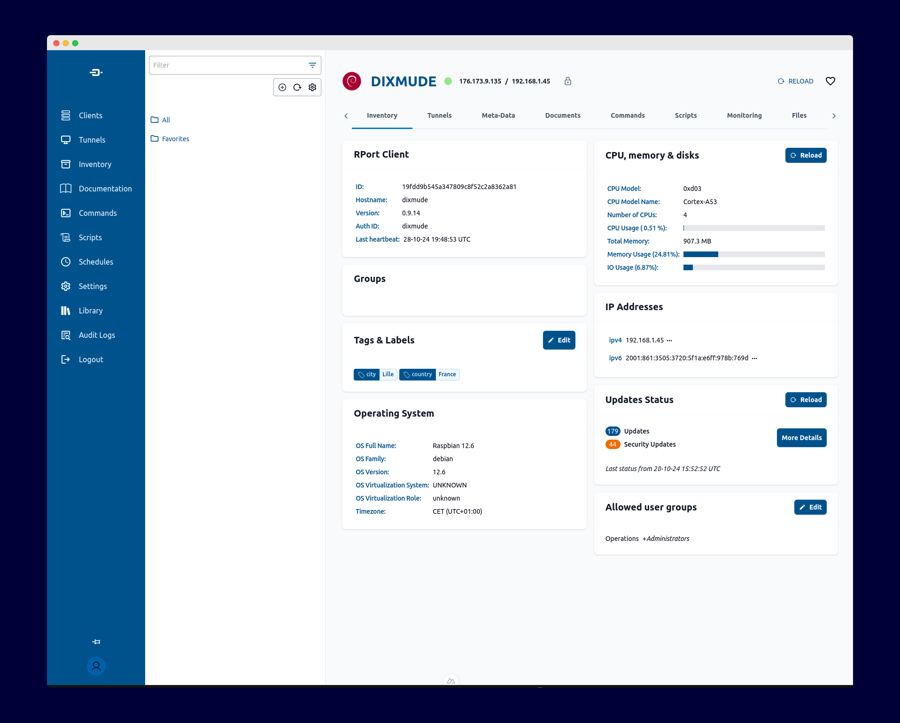

<br>
<p align="center">
    <a href="https://kb.openrport.io" target="_blank" rel="noopener noreferrer">
        
    </a>
</p>

<h1 align="center"> OpenRPort UI <sup><em>alpha</em></sup> </h1>

<p align="center">
Manage remote systems with ease
</p>

<br/>

<p align="center">
    <a href="https://discord.gg/HQ4wMQmzcu"></a>
</p>

<p align="center">
    <a href="https://kb.openrport.io" target="_blank" rel="noopener noreferrer" >
        
    </a>
</p>

# OpenRport UI

- [Documentation](https://ui.nuxt.com/pro/getting-started)
- [OpenRPort](https://github.com/openrport/openrport)

Welcome to the new UI of OpenRport, an open-source remote server manager without the hassle of VPNs. This project is designed using Nuxt 3 to create a seamless and responsive user interface for managing remote systems securely.

## Getting started
---

### Install
```
git clone git@github.com:openrport/openrport-ui.git
cd openrport-ui
yarn install
```


### Configuration

Start to fill out your env file. The most import variable is `NUXT_API_URL`
That should be the url of your OpenRPort instance.

```
cp .env.example .env
yarn dev

```

#### Cors configuration

During the developement to allow cross-origin resource sharing (CORS) for all domain in the OpenRport back-end, you need to modify rportd.config file. This is useful because in development your front-end is on different domain than your back0end.

1. Open your `rportd.conf` file (path: `/etc/rport/rportd.conf`).
2. In the `[api]` section, locate or add the cors settings.
3. Update the setting to allow all origins by setting it to `*`:

```conf
[api]
# Other configurations

## Allowed origins for cross-origin requests.
cors = ["*"]

```

This configuration will enable requests from all domains, which is useful for development purposes. For production, it's recommended to specify a list of allowed domains or leave it empty.

4. Save the changes and restart OpenRport service to apply the new configuration:
```bash
sudo systemctl restart rportd
```

### Credits
- Thanks to [Johan Cabeza](https://github.com/cryptodev4) for the great work on the design.
